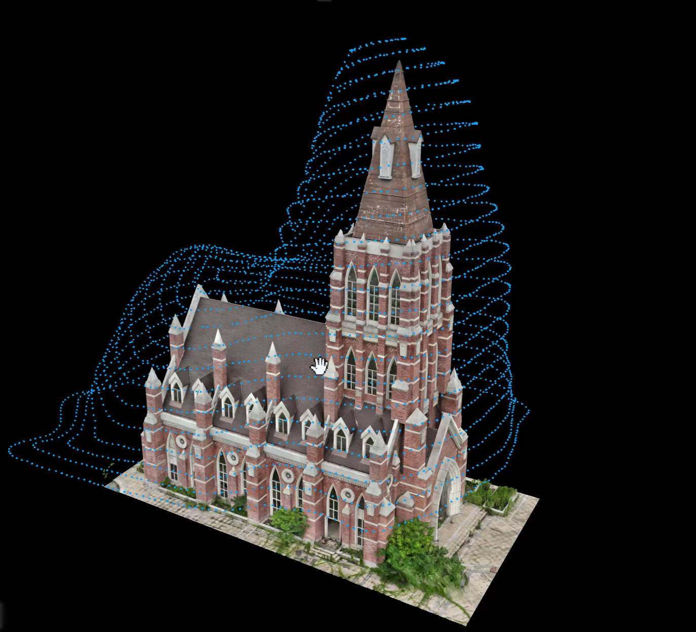
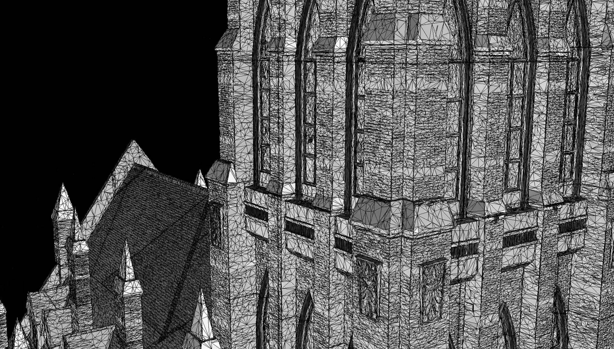
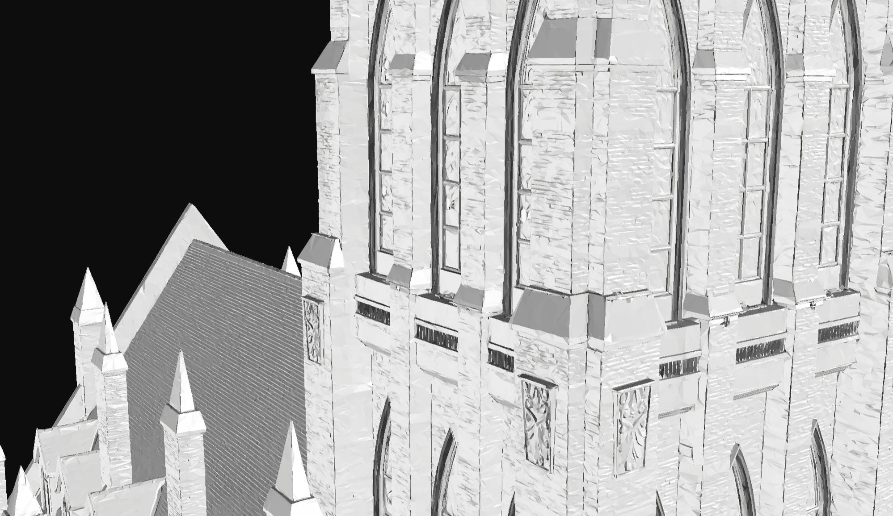
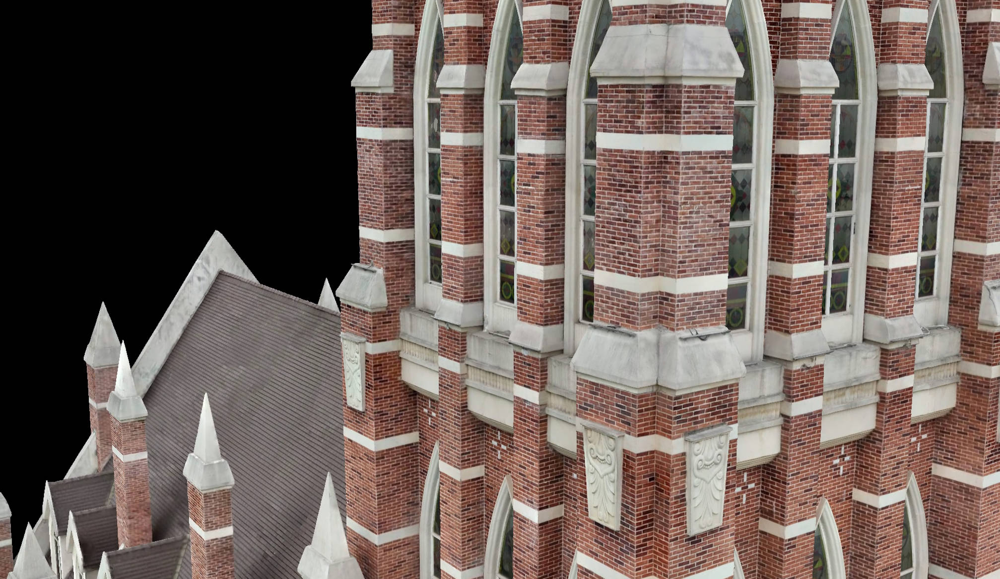

# DJI Matrice 4E Smart 3D Capture Sample Dataset

## Basic Information

Download Link: https://link.mipmap3d.com/1SmGjllN  

| Parameter             | Value          |
|:---------------------:|:--------------:|
| Number of Images      | 2,798          |
| Image Resolution      | 5282 × 3956    |
| Distortion Correction | Disabled       |
| Data Capture Time     | ~30 minutes    |

Scene Overview    

## Geospatial Information
GPS coordinates in EXIF and XMP metadata have been transformed. The conversion maintains relative positions between images through a **rigid transformation**:  
`BLH → ECEF → (Helmert Transformation) → Fake ECEF → Fake BLH`

## License
**CC-BY-NC 4.0**  
*Non-commercial use with attribution required.*

## 3D Model Generated by MipMap
**3D Model Video**: [https://www.youtube.com/shorts/yhvo3y7XP6Q](https://www.youtube.com/shorts/yhvo3y7XP6Q)

Wire  

Mesh  

Textured Mesh  
  

### Reconstruction Performance  

Processing Time: 3 hours 37 minutes

| Hardware        | Specification                  |
|:---------------:|:------------------------------:|
| CPU             | 13th Gen Intel® Core™ i9-13900K |
| GPU             | NVIDIA GeForce RTX 4090       |
| RAM             | 127.69 GB                     |

---

## About MipMap
MipMap is a photogrammetry software solution specializing in drone mapping data processing.  

### Core Features:
⚡️ Blazing-fast data processing  
🎯 Survey-grade accuracy  
🔗 Seamless DJI drone integration  
🌍 City-scale data processing capability  
🧩 Intuitive user experience  
💰 Remarkably affordable pricing

> **MipMap Global Subscription** coming soon...
